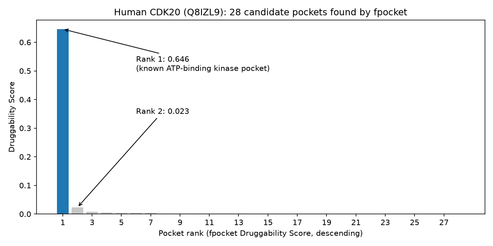
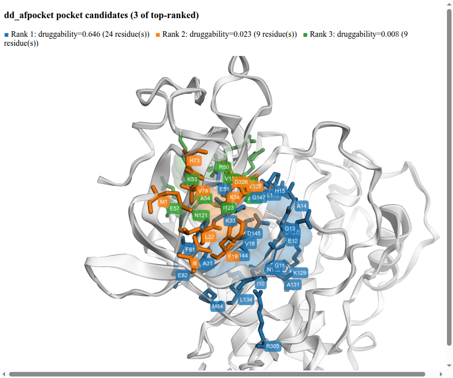
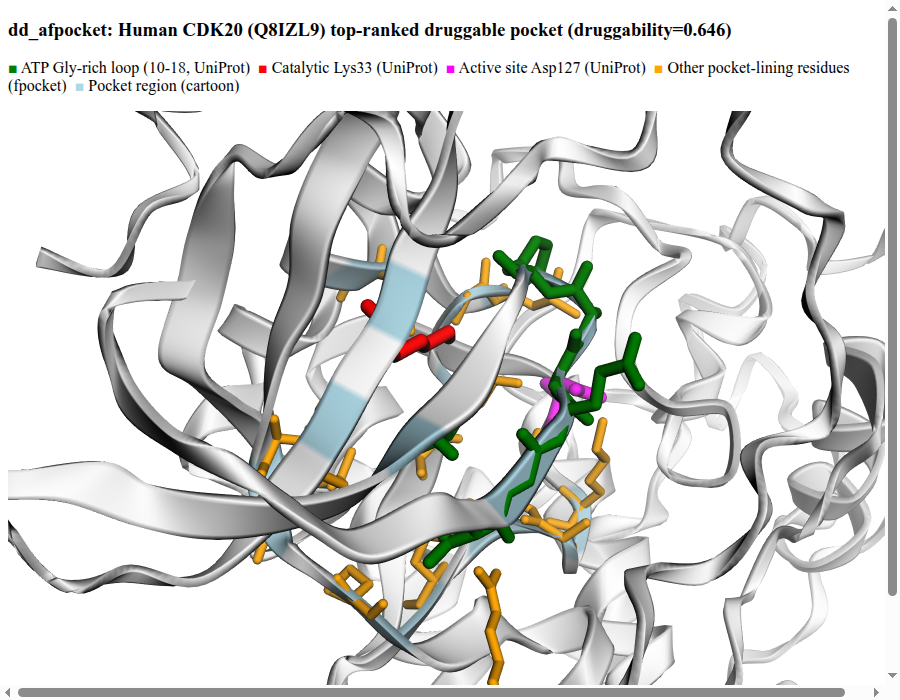
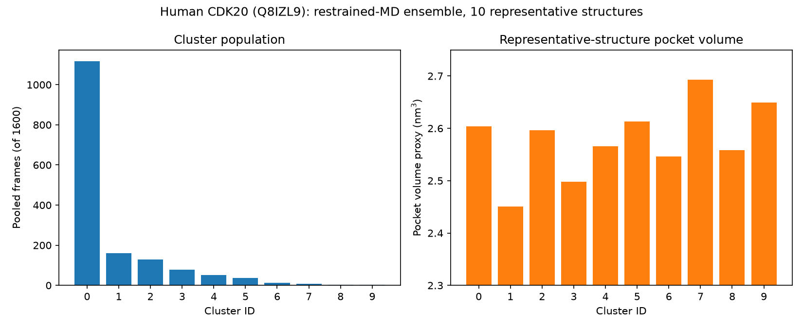
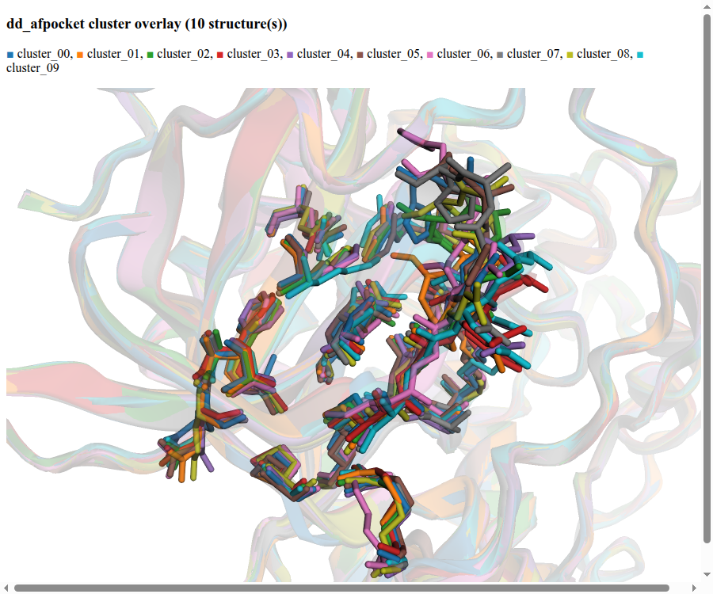

[Japanese version](Example_CDK20.jp.md)

# Example: Human CDK20 (UniProt Q8IZL9) — from one AlphaFold model to a validated pocket and a docking-ready conformational ensemble

This is a full, real worked example of `dd_afpocket`'s four stages —
**fetch → pocket → sample → cluster** — run end to end on a real target:
human CDK20 (Cyclin-dependent kinase 20, gene names `CDK20`/`CCRK`/`CDCH`,
UniProt [Q8IZL9](https://www.uniprot.org/uniprotkb/Q8IZL9), 345 residues).
Every number and image below is from an actual run, not a mock-up. All
underlying files (interactive HTML views, JSON reports, CSV, PNG screenshots)
are checked into this repository under [`examples/cdk20/`](examples/cdk20/).

## Why CDK20?

CDK20 has no co-crystallized inhibitor structure widely available, and no
prior `dd_afpocket` run had been validated against it — a good test of
whether pocket detection from an AlphaFold model alone (no experimental
structure, no known ligand) actually finds a real, biologically meaningful
pocket, checked against UniProt's own independently-curated active-site
annotation.

## 1. Fetch: AlphaFold DB model → MD-grade structure

```bash
dd_afpocket-fetch Q8IZL9 -o data/prepped
```

```
[q8izl9] chains=A residues=345 chain_breaks=0 disulfides=0
[q8izl9] PDBFixer: 0 missing residue(s) found, 1 missing atom(s) added
[q8izl9] PDBFixer: added atom(s) OXT to A:345 GLU
[q8izl9] pLDDT: very_low=8%, low=6%, confident=21%, very_high=65%; trimmed 0 N-term / 1 C-term residue(s)
[q8izl9] -> data/prepped/q8izl9_md.pdb
```

65% of the model is "very high confidence" (pLDDT ≥ 90) by AlphaFold's own
metric, and only 1 low-confidence C-terminal residue needed trimming —
overall a reliable starting structure for pocket detection.

## 2. Pocket detection: does `dd_afpocket-pocket` find the real ATP site?

```bash
dd_afpocket-pocket data/prepped/q8izl9_md.pdb -o data/prepped/q8izl9_pocket --visualize
```

fpocket found **28 candidate pockets** across the whole structure. Ranked by
Druggability Score, the gap between rank 1 and everything else is stark:



| Rank | Druggability | Alpha spheres | Volume (ų) |
|---|---|---|---|
| **1** | **0.646** | 95 | 794.1 |
| 2 | 0.023 | 33 | 369.4 |
| 3 | 0.008 | 33 | 338.7 |
| 4 | 0.005 | 38 | 523.4 |
| 5 | 0.004 | 43 | 338.6 |
| 6 | 0.004 | 38 | 383.2 |
| 7 | 0.004 | 32 | 353.5 |
| 8 | 0.002 | 18 | 91.8 |
| 9 | 0.001 | 21 | 170.6 |
| 10 | 0.001 | 28 | 237.0 |
| 11–28 | ≤ 0.001 | — | — |

Rank 1 is **~28x more druggable** than rank 2. Everything past rank 2 is a
shallow surface indentation, not a real druggable cavity.

### Cross-checking rank 1 against UniProt's own annotation

`dd_afpocket-pocket` doesn't know anything about CDK20 biology — it only
sees geometry. So the real test is: does its top pick line up with what's
*independently* known about this protein? UniProt Q8IZL9 annotates a protein
kinase domain (residues 4–288) with specific catalytic/binding residues.
Rank 1's 24 lining residues include exactly the residues UniProt calls out:

| dd_afpocket-detected residue(s) | UniProt annotation |
|---|---|
| A:10, 11, 12, 13, 14, 15, 18 | **ATP binding site 1** — Gly-rich loop, residues 10–18 |
| A:33 | **ATP binding site 2** — catalytic Lys33 |
| A:127 | **Active site** — catalytic-loop proton acceptor |
| A:31, 51, 65, 81, 82, 84, 129, 131, 132, 134, 144, 145, 147, 148, 305 | Hinge/catalytic-loop neighborhood (typical ATP-pocket wall residues) |

This is essentially exact agreement with the literature-curated ATP-binding
kinase pocket — from geometry alone, with no prior knowledge of CDK20 fed
into the detector.

### Visualizing the top 3 candidates — residues, and the actual cavity volume

`--visualize` (added in `dd_afpocket` v0.2.0, see the main [README](README.md))
writes [`pocket_candidates.html`](examples/cdk20/pocket_candidates.html) — an
interactive, standalone (open directly in any browser, no server needed)
comparison of the top 3 candidate pockets: each one's lining residues as
color-coded sticks, its fpocket alpha-sphere cloud as a solid sphere cluster
depicting the *actual empty-space cavity volume* (not just the residues
around it), and one label per residue.



Blue (rank 1, druggability 0.646) is both far bigger and forms a genuine
enclosed cavity between two β-strands of the kinase fold. Orange (rank 2,
0.023) and green (rank 3, 0.008) are small, shallow, and only partially
enclosed — visually confirming the druggability-score gap above.

A closer, single-pocket view of rank 1 alone, colored by UniProt annotation
(Gly-rich loop in green, catalytic Lys33 in red, active-site Asp127 in
magenta, other lining residues in orange):



Interactive versions: [`pocket_candidates.html`](examples/cdk20/pocket_candidates.html) · [`pocket_view.html`](examples/cdk20/pocket_view.html)

Raw data: [`pocket_report.json`](examples/cdk20/pocket_report.json) · [`pocket_box.json`](examples/cdk20/pocket_box.json)

## 3. Restrained-MD sampling: how flexible is this pocket?

```bash
dd_afpocket-sample data/prepped/q8izl9_md.pdb data/prepped/q8izl9_pocket \
    -o data/sample/q8izl9 --platform OpenCL
```

Default preset: 4 independent replicas, 20 ps equilibration + 2 ns production
each, GBn2 implicit solvent, `amber14-all` forcefield, 4 fs timestep (HMR).
276 residues outside the pocket neighborhood were harmonically restrained;
69 mobile residues (pocket-lining residues plus everything within 1 nm of
the pocket centroid) were left completely free.

**A real-machine note on `--platform`:** this machine has an NVIDIA GTX 1660
Ti, but `--platform CUDA` failed outright with
`CUDA_ERROR_UNSUPPORTED_PTX_VERSION` — the installed driver (560.35.05,
CUDA 12.6) is older than the CUDA toolkit `openmm`'s conda-forge build was
compiled against (12.9), and OpenMM's CUDA plugin refuses to load PTX built
for a newer toolkit than the driver supports. `--platform OpenCL` uses the
same GPU without this driver/toolkit version coupling and ran without issue
— worth knowing if you hit the same error on your own machine.

| Replica | Frames | Wall time |
|---|---|---|
| 1 | 400 | 561 s |
| 2 | 400 | 570 s |
| 3 | 400 | 573 s |
| 4 | 400 | 577 s |
| **Total** | **1600 pooled** | **2281 s (~38 min)** |

Temperature stayed within 290–308 K throughout every replica (target 300 K)
— the restrained system is thermally stable, not blowing up or drifting.

Raw data: [`restraint_report.json`](examples/cdk20/restraint_report.json)

## 4. Clustering into a representative conformational ensemble

```bash
dd_afpocket-cluster data/sample/q8izl9 data/prepped/q8izl9_pocket \
    -o data/clusters/q8izl9 --n-clusters 10 --visualize
```

The 1600 pooled frames were clustered (pocket-CA RMSD, average-linkage
agglomerative clustering) into 10 representative structures (each the
cluster's medoid frame, never a coordinate average):



| Cluster | Frames | Mean intra-cluster RMSD (Å) | Pocket volume proxy (nm³) | Source replica @ time |
|---|---|---|---|---|
| 00 | 1118 | 0.663 | 2.604 | replica 3 @ 92 ps |
| 01 | 161 | 0.691 | 2.451 | replica 2 @ 357 ps |
| 02 | 129 | 0.635 | 2.596 | replica 1 @ 142 ps |
| 03 | 78 | 0.655 | 2.498 | replica 2 @ 326 ps |
| 04 | 52 | 0.599 | 2.566 | replica 2 @ 311 ps |
| 05 | 37 | 0.684 | 2.613 | replica 3 @ 386 ps |
| 06 | 12 | 0.606 | 2.546 | replica 4 @ 201 ps |
| 07 | 8 | 0.510 | 2.693 | replica 4 @ 33 ps |
| 08 | 3 | 0.427 | 2.558 | replica 4 @ 30 ps |
| 09 | 2 | 0.263 | 2.649 | replica 2 @ 145 ps |

Cluster 00 is by far the dominant, "typical" pocket shape (70% of all pooled
frames), with the other 9 clusters capturing rarer but structurally distinct
side-chain/loop arrangements — pocket volume varies from 2.45 to 2.69 nm³
across the ensemble, real (if modest) conformational diversity around the
ATP site.

Overlaying all 10 representative structures (pocket-lining residues in
sticks, one color per cluster, over a shared translucent cartoon):



The visibly different rotamer positions across colors confirm the restrained
MD is actually sampling pocket flexibility, not just thermal noise around a
single fixed conformation.

Interactive version: [`cluster_overlay.html`](examples/cdk20/cluster_overlay.html)

Raw data: [`cluster_report.csv`](examples/cdk20/cluster_report.csv)

## Conclusion

Starting from nothing but a UniProt accession, `dd_afpocket` detected a
pocket that matches CDK20's literature-annotated ATP-binding kinase site
almost exactly, quantified how much more druggable it is than every other
candidate on the structure (~28x), and produced 10 representative receptor
conformations capturing real (if modest) pocket flexibility — all in about
40 minutes of compute on one consumer GPU.

## Next step: ensemble docking

The 10 representative structures under [`examples/cdk20/`](examples/cdk20/)
are ready to hand to `dd_docking` as an ensemble-docking receptor set,
together with the docking box from `pocket_box.json` (center/size, since
these are apo structures with no co-crystallized ligand to derive a box
from) — see the main [README](README.md)'s "Feeding the ensemble into
dd_docking" section for the exact command.

## Files in this example

| File | What it is |
|---|---|
| `examples/cdk20/pocket_report.json` | Selected (rank 1) pocket: residues, center, druggability score |
| `examples/cdk20/pocket_box.json` | Docking box (center/size) derived from the pocket residues |
| `examples/cdk20/pocket_view.html` | Interactive 3D view: rank-1 pocket, colored by UniProt annotation |
| `examples/cdk20/pocket_candidates.html` | Interactive 3D view: top-3 candidate pockets, residues + cavity volume + labels |
| `examples/cdk20/restraint_report.json` | Restrained-MD run settings and frozen/mobile residue counts |
| `examples/cdk20/cluster_report.csv` | 10 representative structures: frame counts, RMSD, pocket volume |
| `examples/cdk20/cluster_overlay.html` | Interactive 3D view: all 10 representative structures overlaid |
| `examples/cdk20/images/*.png` | Static screenshots/charts of all of the above, used in this document |
